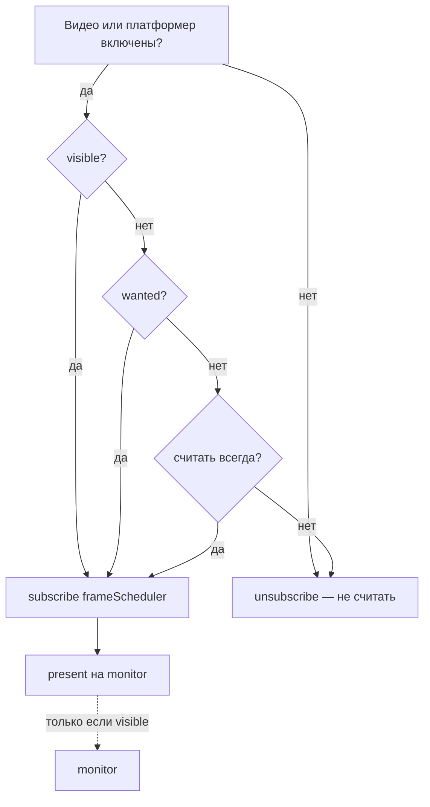

# Этап 5 — считать только если нужно

Разделить два дела: **посчитать картинку** (cook) и **показать её на экране** (present / viewer).

В TouchDesigner оператор может cook’иться без окошка и может быть выключен, если граф его не использует. Здесь то же, но без полной сети операторов — только «нужен ли этот паттерн прямо сейчас».

Это **не** [4c.11 present](done/04c-11-present.md): там «насколько дёшево копировать на monitor». Здесь — «вызывать ли `onFrame` вообще».

## Сейчас

`updatingOn` / `playingOn` → сразу `frameScheduler.subscribe('video:…' | 'platformer:…')`. Скрытый слот уже не получает monitor (`bindCanvas(undefined)`), и `present` без monitor ничего не рисует — **показ** частично ок. Но **счёт** (push кадра, шейдер, world step) идёт всё равно.

Точка в навбаре (`patternHasBackgroundActivity`) = «видео/платформер/room/demo включены», а не «кто-то реально потребляет кадр».

## Два флага на паттерн

| Флаг | Смысл | Откуда |
|------|--------|--------|
| **visible** | Есть monitor на экране (слот открыт или demonstration) | `bindCanvas` / есть `buffer.monitor` |
| **wanted** | Кто-то хочет свежие пиксели этого паттерна | граф спроса ниже |

**Cook** (подписка на `frameScheduler`): процесс включён (`updatingOn` / `playingOn`) **и** (`visible` **или** `wanted` **или** явный «считать всегда»).

**Present**: только если `visible` и картинка изменилась / идёт cook (как сейчас — без monitor skip).

Скрытый, но `wanted` → cook без present. Скрытый и никто не читает → unsubscribe, камера/тик не жрут кадр.

## Граф спроса (`wanted`)

Не TD-граф всех CF. Список **прямых** читателей пикселей паттерна `P`:

1. **Video source** — у другого паттерна `sourceType = Pattern` и `sourcePatternId === P`, и у того видео `updatingOn`.
2. **DEPTH / cut** — паттерн в списке depth CF, и это CF реально крутится у живого видео (уточнить по коду при реализации).
3. **Кисть | pattern** — `brush.params.Pattern.patternId === P` (пока выбран в UI).
4. **Линия | фон / trailing / pattern** — `line.params.patternId === P` при типе SolidPattern / TrailingPattern / Pattern.
5. **Платформер** — `P` как фон/игрок у играющего платформера (если такие ссылки есть).
6. **Room / demonstration** — уже в `patternHasBackgroundActivity`; demonstration часто даёт visible, room — wanted даже без слота.

Обратные рёбра: «кто читает меня» удобно держать в сервисе/реестре, а не сканировать весь store на каждый кадр.

При смене source / stop video / смене кисти / stop platformer — пересчитать `wanted` у затронутых id и вызвать `syncCook(id)`.

## `syncCook(patternId)`

Одна точка вместо «start при updatingOn навсегда»:

1. Прочитать: процесс вкл?, visible?, wanted?, always?
2. Нужен cook, подписки нет → `videoService.start()` / `platformer.start()` (или лёгкий `resumeFrame`).
3. Cook не нужен, подписка есть → `stop()` / `pauseFrame` (процесс в UI остаётся «вкл», камера может остаться открытой или тоже паузить — решить отдельно; минимум — снять с `frameScheduler`).
4. Переход idle → cook: **сразу один** `onFrame` (или `pushSourceFrame`), чтобы первый кадр у потребителя не был чёрным.

Вызывать из: `bindCanvas` / unbind, start/stop video & platformer, `setSourcePatternId`, смена DEPTH/кисти, вкл demonstration.

## Навбар

Точка «фоновая активность» = **идёт cook** (есть подписка), не просто `updatingOn`. Иначе скрытое забытое видео с точкой врёт, а нужный скрытый source без точки — тоже врёт.

## Сломается, если ошибиться

- Скрытый source замирает → потребитель чёрный/старый.
- Выбрали скрытый source — нет немедленного кадра.
- Спрятали слот, паттерн ещё source — ошибочно unsubscribe.
- Точка в навбаре не совпадает с cook.
- Demonstration / room отвалились от visible/wanted.
- Цикл A←B←A: оба wanted, оба cook (ок); не строить полный topo-sort в этом этапе.

## Где смотреть

- [`cook/syncCook.ts`](../../../src/store/patterns/cook/syncCook.ts) — `shouldCook*` / `syncPatternCook`
- [`FrameScheduler`](../../../src/utils/FrameScheduler.ts)
- [`PatternVideoService.start/stop`](../../../src/store/patterns/_service/patternServices/PatternVideoService/index.ts)
- [`PatternPlatformerService.startFrame/stopFrame`](../../../src/store/patterns/_service/patternServices/PatternPlatformerService/index.ts)
- [`patternHasBackgroundActivity`](../../../src/store/patterns/selectors.ts)
- [`Pattern/index.tsx` `syncMonitors`](../../../src/components/Pattern/index.tsx) — visible → monitor
- video `sourcePatternId`, depth CF, brush pattern id, `alwaysCook`

## Порядок внедрения

1. Реестр спроса + `syncCook` для видео; visible = есть monitor.
2. Подключить video-source и навбар.
3. Платформер тем же правилом.
4. DEPTH / кисть / always — по необходимости.
5. Проверки из «готово когда» + demonstration.

## Готово когда

- Скрытое видео, которое никто не смотрит и не читает, не ест кадр.
- Скрытый source для видимого видео считается; первый кадр после выбора source не пустой.
- Слот спрятан, паттерн ещё source — счёт жив.
- Чтобы не потерять пиксели, не нужно прятать слот через CSS (это уже этап 1).

## Не входит

Сеть операторов как в TD, автограф всех change functions, оптимизация цены `present` (это 4c.11).
