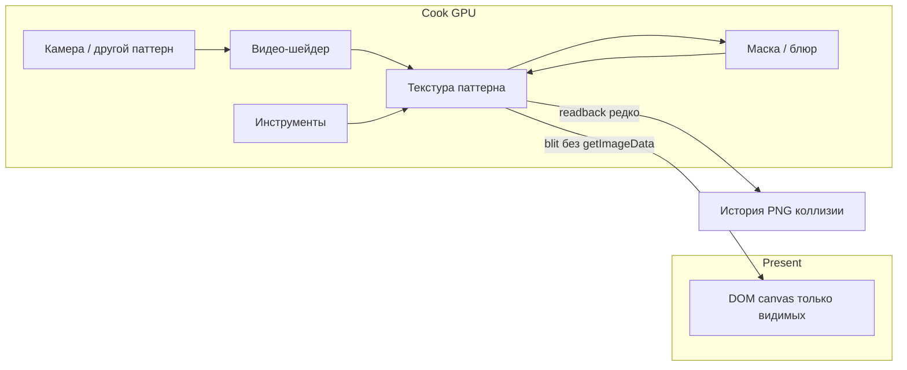

# GPU-пайплайн (TouchDesigner-парадигма)

Пиксели паттерна сейчас живут в DOM 2D-канвасе. Соседи (видео, кисть-паттерн, превью, блюр) часто делают `getImageData` — копию в CPU каждый кадр.

Цель: буфер на GPU, экран только монитор. Readback — история, PNG, коллизии платформера. Снаружи редактор тот же.

Стек: **WebGL2**, один `GlContext` на приложение. Видео уже на WebGL2 (`ShaderVideoModule`). WebGPU не в первом проходе.

React / показ нескольких паттернов ортогональны: несколько presenter’ов на те же текстуры. Скрытие DOM-слота не должно быть способом хранить пиксели.

## Этапы

| Файл | Что |
|------|-----|
| [00-contract-and-profiling.md](00-contract-and-profiling.md) | Контракт `PatternBuffer`, белый список readback, базовый замер кадра |
| [01-buffer-off-css.md](01-buffer-off-css.md) | Пиксели вне CSS; DOM-canvas только presenter видимого |
| [02-video-stays-on-gpu.md](02-video-stays-on-gpu.md) | Выход видео и source pattern без `getImageData` на кадр |
| [03-masked-preview.md](03-masked-preview.md) | Masked / превью / кисть-паттерн без полного CPU-композита |
| [04-tools.md](04-tools.md) | Инструменты: мост 2D→GPU, затем штампы на GPU |
| [05-cook-graph.md](05-cook-graph.md) | Cook vs present: не считать граф без потребителей |

Порядок обязательный. Этап 4 без 2–3 не делать.

## Объекты слоя

- **`PatternBuffer`** — **ещё не существует в коде.** Планируемый объект «пиксели паттерна»: текстура на GPU, не DOM-канвас. Этап 0 только фиксирует интерфейс.
- **`Presenter`** — DOM `<canvas>` у видимых; blit текстуры. Мышь и координаты как сейчас в `CanvasEventsService`.
- **`GlContext`** — один `WebGL2RenderingContext`. Видео-шейдер сюда, не свой `glCanvas` на паттерн.
- **Cook vs present** — video/platformer идут, если оператор включён (`updatingOn` / `playingOn`), даже без монитора. Present — только видимые.

`PatternCanvasService` становится фасадом: `getImageData()` остаётся и помечается как дорогой путь.

## Что остаётся на CPU

История, сейв/лоад проекта, буфер обмена, PNG, `Collision.rebuild(imageData)` (readback только когда мир грязный).

## Чего нет в этой работе

- Паритет с TouchDesigner (CHOPs, сеть операторов).
- Полный отказ от `ImageData`.
- Что этап 1 сам даст FPS «как TD». Кадр дешевеет на 2–3.

## Критерий правды (после этапа 2)

Паттерн B скрыт, видео A берёт B как source, оба ~1080p.

- Сейчас: `getImageData` B каждый кадр + `drawImage` GL→2D A.
- После: в профиле нет полного readback в `video.getFrameData`; GPU copy/blit; FPS упирается в шейдер, не в CPU.
