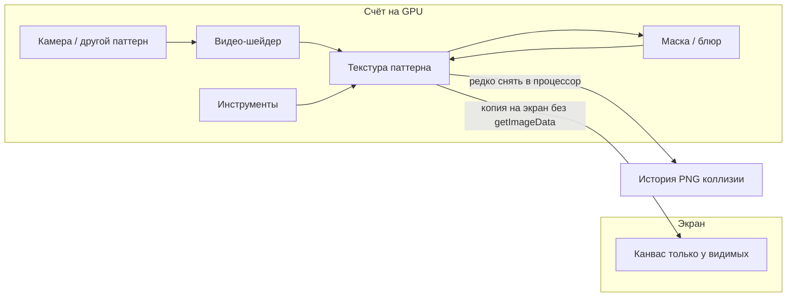

# GPU-пайплайн (как в TouchDesigner)

Пиксели паттерна сейчас живут в канвасе на странице. Соседи (видео, кисть-паттерн, превью, блюр) часто делают `getImageData` — **копируют всю картинку в процессор каждый кадр**.

Цель: картинка лежит в видеопамяти, экран только показывает. В процессор снимаем редко: история, PNG, коллизии платформера. Снаружи редактор тот же.

Стек: **WebGL2**, одна видеокарта-контекст на приложение. Видео уже на WebGL2 (`ShaderVideoModule`). WebGPU пока не трогаем.

Показ нескольких паттернов и React — отдельно: несколько мониторов на те же буферы. Спрятать слот на странице — не способ сохранить пиксели.

## Этапы

| Файл | Что |
|------|-----|
| [done/00-contract-and-profiling.md](done/00-contract-and-profiling.md) | Этап 0 закрыт: интерфейс, опись, эталоны |
| [done/01-buffer-off-css.md](done/01-buffer-off-css.md) | Этап 1 закрыт: пиксели в `PatternBuffer`, канвас на экране — монитор |
| [done/02-video-stays-on-gpu.md](done/02-video-stays-on-gpu.md) | Этап 2 закрыт: нет `getImageData` на кадре видео; заливка 2D→3D осталась (~16.7 ms) |
| [done/03-masked-preview.md](done/03-masked-preview.md) | Этап 3 закрыт: `updateMasked` 45 ms → 0.1 ms, не на кадре видео |
| [04-tools.md](04-tools.md) | Общий GL, буфер = текстура, source как sampler; кисти: штамп 2D→GPU, потом штампы на GPU |
| [05-cook-graph.md](05-cook-graph.md) | Считать картинку только если она нужна; на экран — только видимое |

Порядок: 0–3 закрыты. Дальше 4, потом 5.

## Объекты

- **`PatternBuffer`** — «лист бумаги» паттерна ([`PatternBuffer.ts`](../../../src/store/patterns/_service/patternServices/PatternBuffer.ts)). Лежит в `PatternService` (внутри `canvasService` / `maskService`). Сейчас 2D-канвас вне DOM. GL-текстура — этап 4, вместе с общим `GlContext`.
- **Монитор** — видимый `<canvas>`; пиксели в него только копируют. С него же мышь (`CanvasEventsService`). У скрытого паттерна монитора нет.
- **`GlContext`** — один `WebGL2RenderingContext` на всё приложение. Видео-шейдер сюда, не свой канвас на каждый паттерн.
- **Считать vs показать** — видео/платформер могут крутиться без картинки на экране, если кто-то их читает. На экран копируем только видимые.

`PatternCanvasService.getImageData()` останется для старого кода, но это будет редкий съём в процессор, не «канвас на экране = настоящая картинка». С этапа 1 он уже читает буфер, а не узел страницы.

## Что остаётся на процессоре

История, сейв/лоад проекта, буфер обмена, PNG. Коллизии платформера — съём пикселей, только когда мир изменился, не каждый кадр отрисовки.

## Чего нет в этой работе

- Повторить весь TouchDesigner.
- Выкинуть `ImageData` из приложения.
- Ждать от этапа 1 FPS «как TD». Кадр дешевеет на 2–3.

## Как понять, что сработало (после этапа 4)

Паттерн B скрыт, видео A берёт B как source, оба ~1080p.

- Этап 2: нет `video.source.getImageData`; цена в `video.pushNewFrame`.
- Этап 3: `values.updateMasked` **0.10 ms** на жесте, не на кадре видео ([`baselines/03-after.md`](baselines/03-after.md)).
- После 4: нет заливки 2D-канваса в 3D-текстуру на кадр; source — текстура; FPS упирается в шейдер, не в копию.
