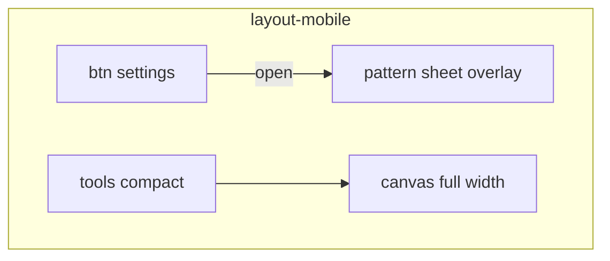

# 02. Мобильный лэйаут (постепенно)

Зависит от [01](01-canvas-touch.md): без пальца по канвасу лэйаут не проверить.

## Сейчас (десктоп)

Один экран, всё сразу:

| Зона | Как устроено |
|------|----------------|
| инструменты + CF | `tools-panel` — fixed сверху слева |
| app / projects | `app-controls` — fixed сверху справа |
| настройки паттерна | `pattern-left` — fixed слева, ширина **210px**, скролл внутри |
| канвас | `pattern-slot--active` с `padding-left: 210px+…`, картинка снизу |

На телефоне: канвас съедает место из‑за левого паддинга, кнопки 70×20, многое открывается только по **hover**, скролл страницы/слота конфликтует с жестами.

В коде уже есть `mobileAndTabletCheck` (UA) — для лэйаута лучше **не** опираться на него. Включать мобильный вид по ширине / «грубому» указателю (`matchMedia`), класс на корень (например `layout-mobile`).

## Куда идём (цель)

Не отдельное приложение. Тот же DOM и те же панели, другая раскладка:

1. **Канвас — главный**: почти на весь экран, без постоянного запаса 210px слева.
2. **Настройки паттерна** (`pattern-left`: video, blur, плагины…) — **лист снизу** (bottom sheet): по кнопке открыть / закрыть; по умолчанию закрыт.
3. **Инструменты** (`tools-panel`) — компактная полоса (сверху или снизу), без перекрытия всей ширины канваса.
4. **Критичные действия** доступны пальцем: инструмент, цвет/кисть, play/file video, открыть настройки паттерна.
5. Пока палец рисует по канвасу — страница и слот **не скроллятся** (`touch-action` / `preventDefault` на жесте).

Ховеры (`:hover` → показать controls) на таче не работают — на мобилке нужен явный показ или всегда видимые ключевые кнопки.

## Постепенный переход

Каждый шаг сам по себе полезен на десктопе узкого окна / планшете. Десктоп широкий — без класса `layout-mobile`, как сейчас.

### Шаг A — только CSS-каркас

- Класс `layout-mobile` по `max-width` (например ≤820px) или `(pointer: coarse)`.
- У активного слота убрать/урезать `padding-left: 210px`.
- `pattern-left`: не `position: fixed` на весь экран слева, а временно скрыть или сузить (можно `transform: translateX(-100%)` + кнопка «настройки»-заглушка).
- Канвас читается на телефоне; настройки можно ещё не идеально открывать.

**Готово A:** на узкой ширине виден канвас на всю ширину, десктоп ≥ брейкпоинта без изменений.

### Шаг B — лист настроек паттерна

- Кнопка «настройки» / «паттерн» (всегда видна в mobile).
- `pattern-left` как **bottom sheet** поверх канваса, свой скролл, закрытие по кнопке / тапу на затемнение.
- Содержимое то же (`VideoControls`, toggles плагинов…), без переноса в другой React-дерево — только обёртка/класс.

**Готово B:** на телефоне открыл настройки, поменял video/blur, закрыл, снова рисуешь.

### Шаг C — инструменты и верх

- `tools-panel` + `app-controls`: не перекрывают жест рисования; перенос/сжатие, горизонтальный скролл ряда кнопок допустим.
- Убрать зависимость от hover для того, без чего нельзя рисовать (выбор инструмента уже в tools — проверить тач).

**Готово C:** кисть/линия/цвет выбираются пальцем, панель не мешает штриху.

### Шаг D — скролл и крупные зоны

- `touch-action: none` (или manipulation) на мониторе канваса во время/для рисования.
- Чуть крупнее хитбоксы у ключевых кнопок **только** в `layout-mobile` (не обязательно раздувать весь десктопный UI).
- Hover-only меню (SelectDrop, HoverHideable): на coarse — открытие по тапу, закрытие по тапу снаружи (если ещё ломается).

**Готово D:** рисуешь и крутишь настройки без войны со скроллом; базовый сценарий «открыл → нарисовал → video play» проходит на реальном телефоне.

## Что не тащим в этот блок

- Отдельный мобильный редизайн всех CF / room / platformer.
- PWA / установка на домашний экран (можно позже отдельной задачей).
- Полноценный мультитач в инструментах ([03](03-volume-gestures.md) — только volume).

## Порядок внутри 02

`A → B → C → D`. После A уже можно жить с [01](01-canvas-touch.md). B — главный UX-скачок. C и D — добивка.

## Готово когда (вся 02)

На телефоне: канвас на ширину экрана, настройки паттерна в открываемой панели, инструменты доступны, скролл не срывает штрих. Широкий десктоп выглядит как раньше.
